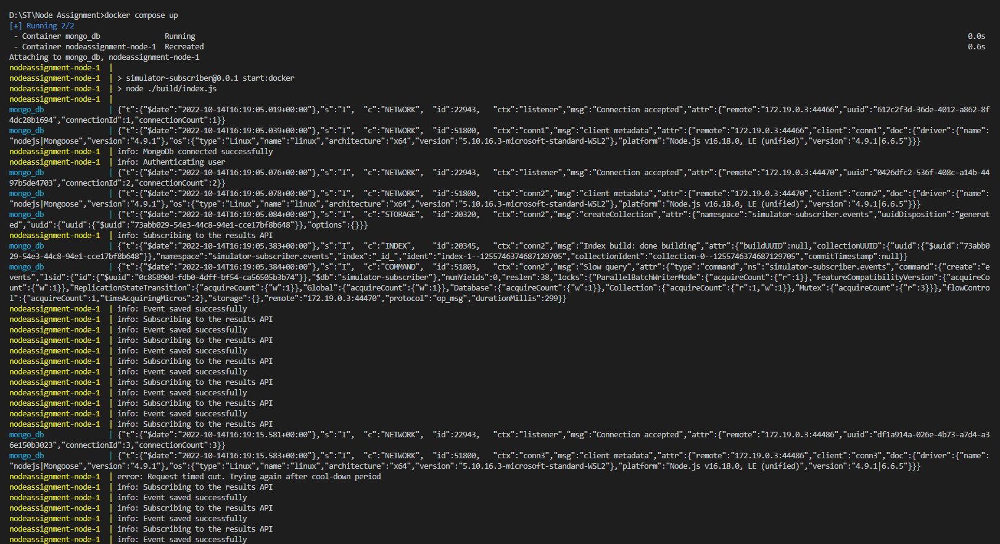
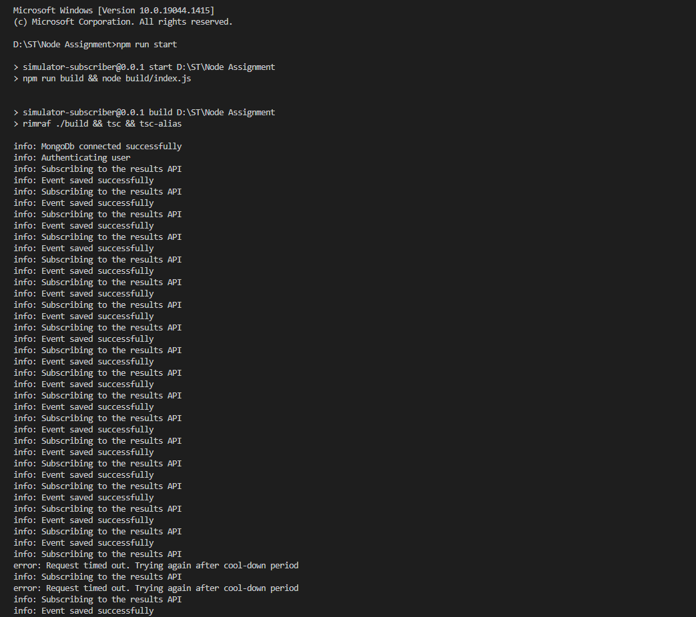
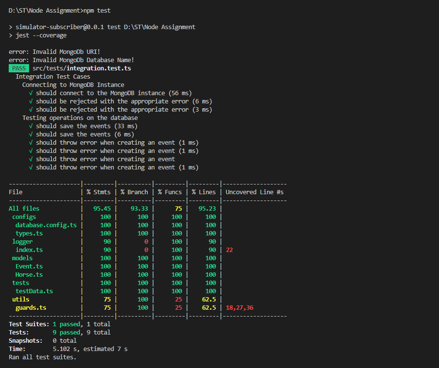
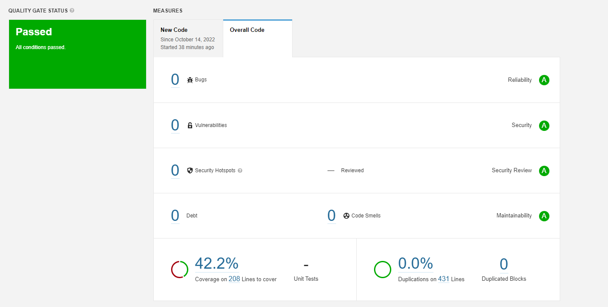
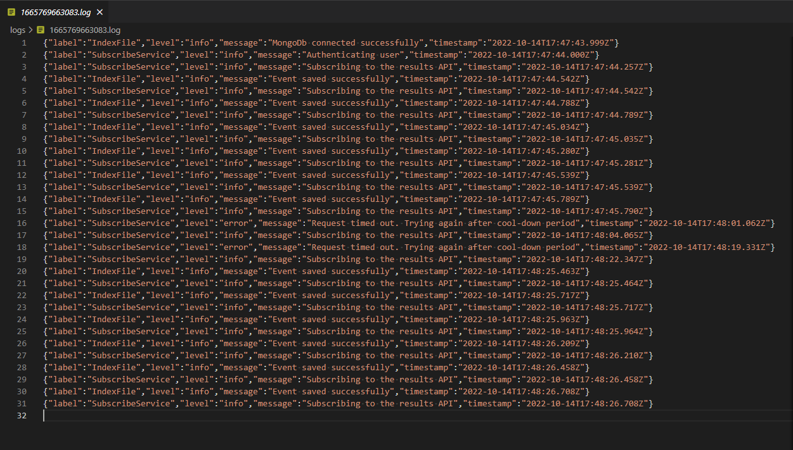

&nbsp;&nbsp;

&nbsp;&nbsp;


# Simulator Subscriber

A NodeJS application that subscribes to a racing simulator and stores the events in a local MongoDb instance.

The trot race simulator runs a new race with six horses every minute of every day.
When any horse starts or finishes the race, an event is sent out in real time via a `REST` API.
This application subscribes to that API through long-polling and saves the events received in a local MongoDb database.
Contacting the API requires a `Bearer` token for authentication which can be obtained by logging in using the `/auth` API.

- [Simulator Subscriber](#simulator-subscriber)
  - [Example](#example)
    - [With Docker](#with-docker)
    - [Without Docker](#without-docker)
  - [Code Coverage](#code-coverage)
  - [Static Code Analysis](#static-code-analysis)
  - [Logging](#logging)
  - [Tech-Stack](#tech-stack)
  - [Dependencies](#dependencies)
  - [Project Structure](#project-structure)
  - [Setup for running locally](#setup-for-running-locally)
    - [Setting environment variables](#setting-environment-variables)
    - [Installing dependencies](#installing-dependencies)
    - [Setting up Local MongoDB Instance [when not running with Docker]](#setting-up-local-mongodb-instance-when-not-running-with-docker)
    - [Running the application](#running-the-application)
    - [Formatting](#formatting)
    - [Linting](#linting)
    - [Testing](#testing)
  - [Using Docker](#using-docker)
    - [Building the image](#building-the-image)
    - [Using `docker compose`](#using-docker-compose)

## Example

### With Docker



### Without Docker



## Code Coverage



## Static Code Analysis

- Static code analysis report has been generated using [Sonarqube Community Server](https://www.sonarqube.org/)



## Logging

- For debugging the application, there are logs available in the logs folder.
- The application creates a new file for every run and uses the timestamp as the file name.
- The logs are saved in `JSON` format as shown in the below screenshot.
- For logging in standard console output, the logs are in string format for better readability.



## Tech-Stack

- NodeJS [with Typescript and Jest]
- MongoDB
- Docker [with Docker Compose]
- Sonarqube
- Eslint
- Prettier

## Dependencies

- The application uses some third-party libraries in order to minimize the code footprint.

| Library                                                              | License      | Version |
| -------------------------------------------------------------------- | ------------ | ------- |
| [dotenv](https://www.npmjs.com/package/dotenv)                       | BSD-2-Clause | ~16.0.3 |
| [http-status-codes](https://www.npmjs.com/package/http-status-codes) | MIT          | ~2.2.0  |
| [mongoose](https://www.npmjs.com/package/mongoose)                   | MIT          | ~6.6.5  |
| [winston](https://www.npmjs.com/package/winston)                     | MIT          | ~3.8.2  |

## Project Structure

```
Node Assignment                         
├─ build                                
├─ extras                               
├─ src                                  
│  ├─ api                               
│  │  └─ index.ts                       
│  ├─ configs                           
│  │  ├─ connectDatabase.ts             
│  │  ├─ constants.ts                   
│  │  └─ types.ts                       
│  ├─ logger                            
│  │  └─ index.ts                       
│  ├─ models                            
│  │  ├─ Event.ts                       
│  │  └─ horseSchema.ts                 
│  ├─ services                          
│  │  ├─ authenticate.ts                
│  │  └─ subscribe.ts                   
│  ├─ tests                             
│  │  ├─ integration.test.ts            
│  │  └─ testData.ts                    
│  ├─ utils                             
│  │  ├─ guards.ts                      
│  │  └─ state.ts                       
│  └─ index.ts                          
├─ docker-compose.yml                   
├─ .env.sample                          
├─ Dockerfile                           
├─ jest.config.js                       
├─ nodemon.json                         
├─ package-lock.json                    
├─ package.json                         
├─ README.md                            
└─ tsconfig.json                        
```

## Setup for running locally

### Setting environment variables

- The application uses environment variables for secret management.
- A sample file `.env.sample` is included which contains all the variables used throughout the project.
- Create a copy of the sample file and name it `.env`
- Populate the variable values accordingly.

### Installing dependencies

- To install the dependencies, run the command `npm install`

### Setting up Local MongoDB Instance [when not running with Docker]

This application uses a local MongoDB instance when it is not running inside a Docker container.
To setup a local MongoDB instance:
1. Download the [MongoDB Server - Community Edition](https://www.mongodb.com/try/download/community)
2. Install the server
3. Start the `mongod` service using `CLI`. [Reference](https://www.mongodb.com/docs/manual/tutorial/manage-mongodb-processes/)
4. Connect to the localhost instance using [MongoDB Compass](https://www.mongodb.com/products/compass)

For using the instance in the application, change the `MONGO_URI` variable in the `.env` file.

> Note: The application connects to `35.207.169.147`. Thus make sure you are not in a restricted network connection.

### Running the application

- To run the application, run the command `npm start`
- Alternatively, to start the application in `development` or `hot-reload` mode, run the command `npm run start:dev`.
- Running in `hot-reload` mode uses `nodemon` and `ts-node` to restart the application whenever any file is changed.

### Formatting

- This application uses `Prettier`.
- Run the command `npm run format` to format the code.

### Linting

- This application is setup to use `Eslint` with `Typescript` type checking.
- Run the command `npm run lint` to check for linting errors.

### Testing

- The application uses `Jest` as a testing framework for writing unit test cases.
- To run the test cases, run the command `npm run test`.
- Running the test command also shows the code coverage.

## Using Docker

> Prerequisites:
> - To run the application inside Docker container make sure you have `Docker` installed with `Docker CLI` and `Docker Compose CLI`.
> - If you have `Docker Desktop` installed, then is already comes with the required commands.

- The application has a `Dockerfile` which describes the steps for building an image to be used inside the container
- The `docker-compose.yml` file lists the services that are needed for running the application.
- There are two services:
    1. MongoDB Server
    2. Our application
- The MongoDB server runs in a separate container and exposes the port `20178` for connections. It also uses the volume `mongodb` for storing the data.
- The 2nd container, uses the previously built image to run our application and passes the MongoDB connection string using environment variables.

### Building the image

- If using the `docker compose` command, it builds the image automatically before starting the container
- To build the image separately, run command `docker build -t <image_name> .`
  - Make sure to put a `.` at the end of the command
- The command automatically uses the `Dockerfile` file present in the root of the project
- To run the image, run command `docker run <image_name>`

### Using `docker compose`

- To run the application using `docker compose`, run the command `docker compose up`.
- Running the command automatically uses the `docker-compose.yml` file present in the root of the project.
- The flow of events after running the commands will be
  1. The CLI will download `node` and `mongo` images
  2. Then it will run the `mongo` image as the `docker-compose.yml` file lists `mongo` image as dependency
  3. Once the `mongo` image is built, it will run the `Dockerfile` and build the application image
  4. Then it will run the application image and start the application using the command `npm run start:docker`
